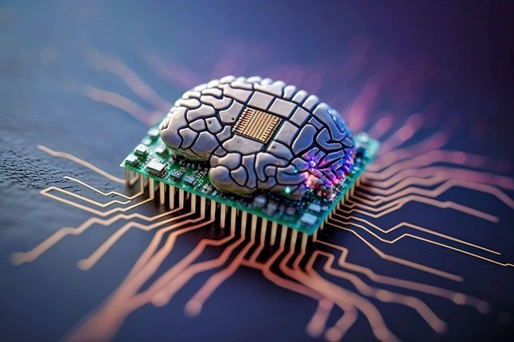

{: .align-right width="300px"}

👨🏻‍💻 I'm a 5th year graduate student at the ECE department of Purdue University.

🔬 My research interests are in Bio-inspired ML (Spiking Neural Networks) and Scene Understanding!

📚 I'm currently studying about Diffusion Models.

<!-- 📽️ I am also interested in assisting others on their path in the world of Machine Learning and academia. -->

# Professional Experience

## 👨🏻‍🔬 Graduate Research Assistant  
Currently I am working as a **Student Researcher** at the Reliable Multimodal AI Lab at the TU Darmstadt under the supervision of Prof. Marcus Rohrbach working on **Generative Video-Language Modelling**.
Additionally, I have professional experience working as an **Applied Machine Learning Student Researcher** at the Fraunhofer Heinrich Hertz Institute. \
There I worked on dynamic traffic flow forecasting using Graph Neural Networks.

## Advanced ML Algorithms Intern
I am working as a **Student Researcher** at the Reliable Multimodal AI Lab at Analog Devices INC. at Boston, MA in the group of Tao Yu working on **Generative Video-Language Modelling**.
Additionally, I have professional experience working as an **Applied Machine Learning Student Researcher** at the Fraunhofer Heinrich Hertz Institute. \
There I worked on dynamic traffic flow forecasting using Graph Neural Networks.

# Selected Publications

